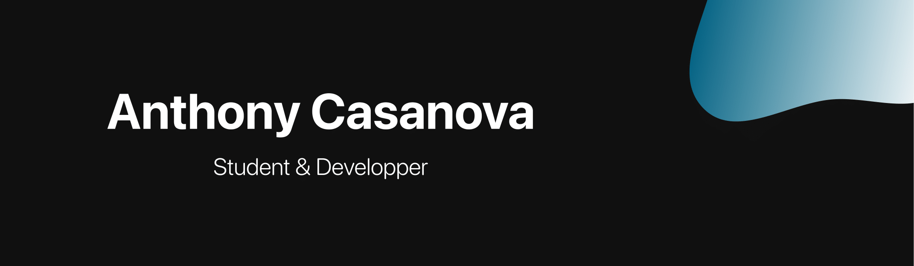

<h1 align='center'> 
Hello, There! 
</h1>

 Hi, my name is Anthony, I'm from France 🇫🇷 and I'm currently a computer science student 🖥 !

 You will find in my repositories some personal projects that I find nice to put forward. So you will find <b>WEB</b> or <b>Mobile</b> applications projects, <b>Python</b> or <b>C++</b> projects but also some <b>DevOps</b> projects. I'm also passionate about <b>Cybersecurity</b> and <b>Blockchain</b> technologies so may find projects in these fields too! I hope you will enjoy it !

<b>PS</b>: Keep Calm and buy croissants 🥐🇫🇷!

<h2 align='center'>🛠 Technologies & Tools</h2>

<h2 align='center'>🚀 Projects & Statistics </h2>

